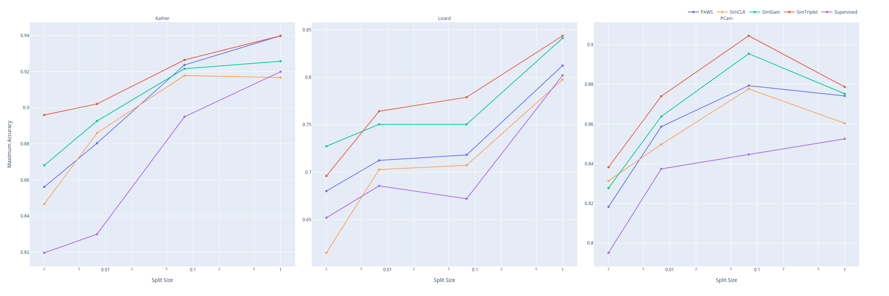

# Investigation of Semi- and Self-Supervised Methods in Histopathology
 This repository is part of the paper XYZ. It contains the implementations of different semi- and self-supervised methods [SimCLR](https://arxiv.org/pdf/2002.05709.pdf), [PAWS](https://arxiv.org/pdf/2104.13963.pdf), [SimSiam](https://arxiv.org/pdf/2011.10566.pdf), and [SimTriplet](https://arxiv.org/abs/2103.05585) to study the benefit of such methods in histopathology. The implementation explores the methods with various network settings on public histopathological datasets, focusing on only a few labeled data available in the training process.




# Result Data and Reproducability
We provide our experimental data in the `result/res` folder to reproduce the results or explore the data. Due to the scripts and notebooks found in the folder, you can create figures and tables used in the paper or explore the result data on your own. For simplicity we provide a docker container with a suited python environment and the needed model checkpoints to create all plots from the paper. Install [docker](https://www.docker.com/) and execute the following comment to start the provided container:

```
docker run -it --rm -p 8888:8888 deepprojects/notebook-showcase-ssl:0.1.2
```

Alternativ, the `reproduce.ipynb` notebook creates all figures and tables except augmentation visualizations and XAI investigation, for these use the corresponding notebooks.

```bash
cd results
python reproduce_results.py
```

# Encoder Training and Finetuning
For training the [determined ai](https://www.determined.ai/) is used. To reproduce models install determined and run a training setting found in the corresponding method configuration folder. The SimTriplet method is included in the `simsiam` folder and can set as a hyperparameter in the configuration file. A training is started with the following determined command:

```bash
det -m <determined-ai-master-url> -u <determined-user> experiment create <train-config-path> <trail-path>
```

Each configuration file corresponds to a specific determined trail. For encoder training the file is found in the method folder and for a finetune on a histopathological dataset it's the global `finetune_trial.py`. As histopathological datasets [NCT-CRC-HE-100K](https://zenodo.org/record/1214456), [PCam](https://github.com/basveeling/pcam), and [Lizard](https://warwick.ac.uk/fac/cross_fac/tia/data/) are used. Such datasets should be download and the data initialization process adjusted to your system. For the Lizard dataset you need to use the script `utils/create_lizard_dataset.py` to apply the modification we did to create a classification problem.  
